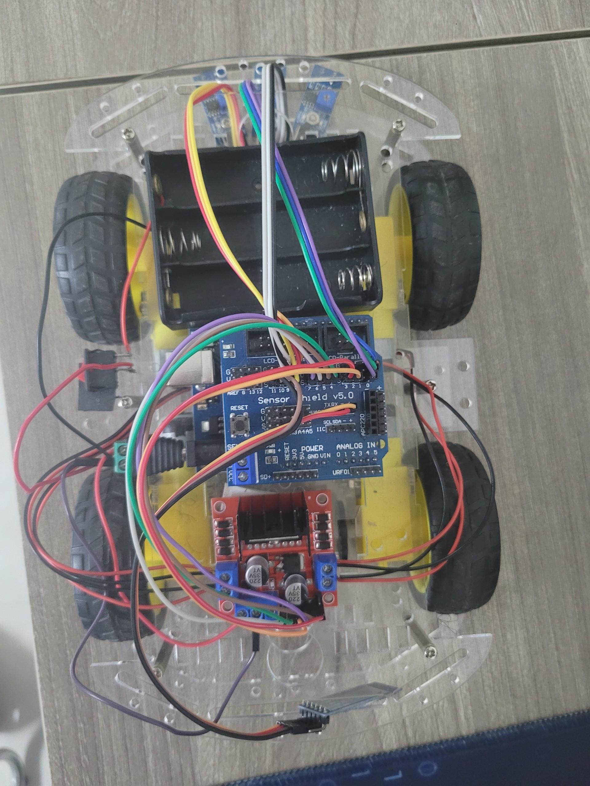
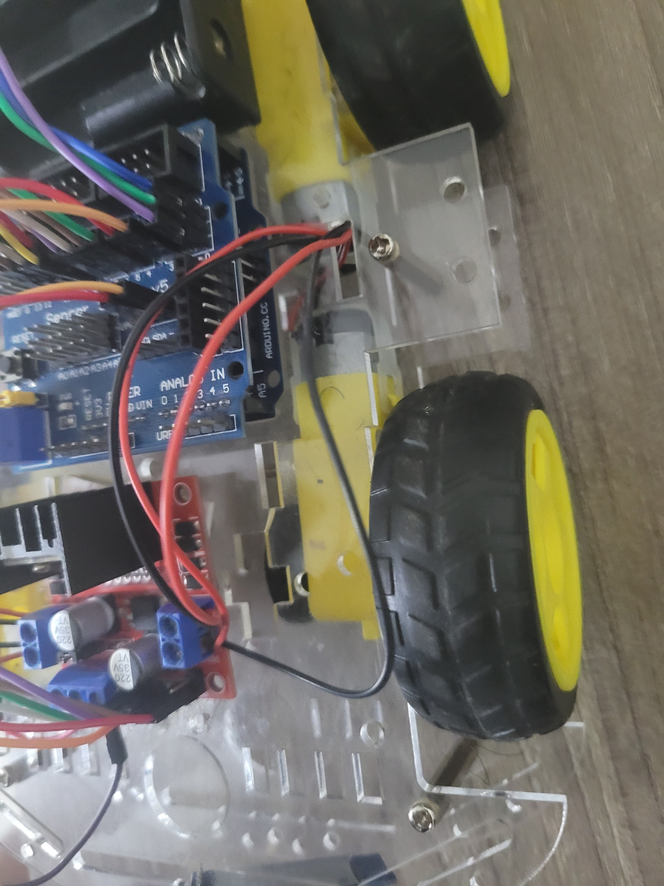
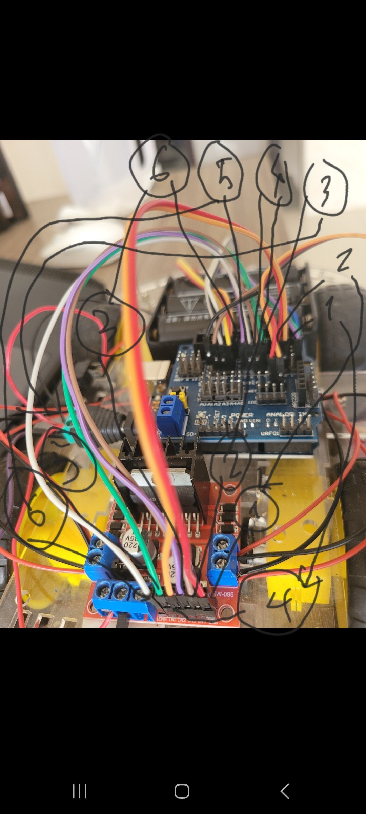
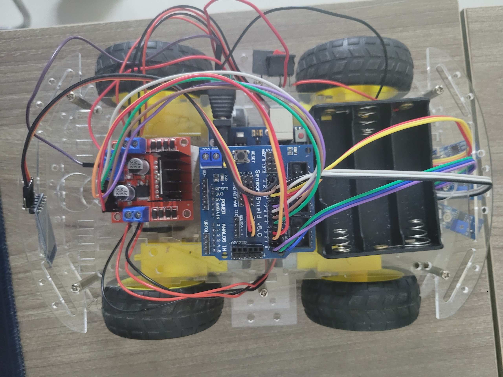

# trackline-and-control-by-bluetooth

This repo uses Arduino code for a contest called Autonomous Car Level 2 in FPT Can Tho University organized.

You can buy and make a car by following the ThietbiLevel2.docx file.

